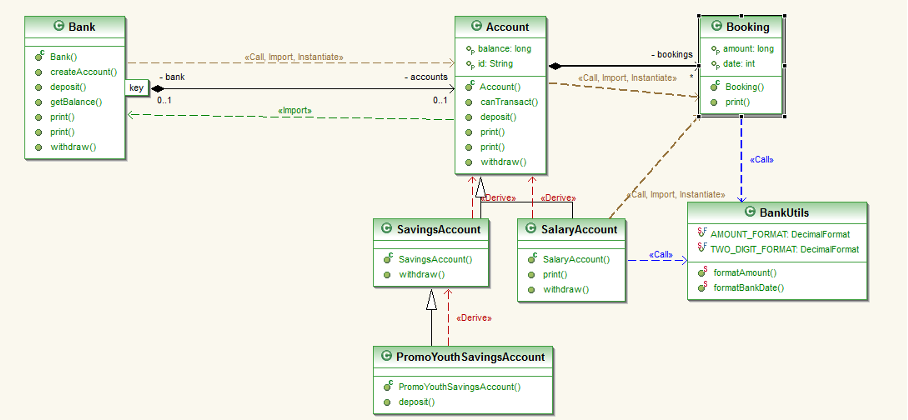

# Uebung 2

JUnit ist ein populäres Framework für das Testen von Java-Anwendungen. Es bietet eine Vielzahl von Funktionen, die das Schreiben und Ausführen von Unit-Tests erleichtern. Hier werden die wichtigsten Features von JUnit zusammengefasst:

## Annotations

JUnit verwendet verschiedene Annotations, um Testfälle zu definieren und zu verwalten. Hier sind die häufigsten:

- `@Test`: Markiert eine Methode als Testmethode.
- `@BeforeEach`: Wird vor jeder Testmethode ausgeführt. Häufig verwendet, um eine gemeinsame Testumgebung vorzubereiten.
- `@AfterEach`: Wird nach jeder Testmethode ausgeführt, um Ressourcen zu bereinigen.
- `@BeforeAll`: Wird einmal vor allen Testmethoden ausgeführt. Häufig für teurere Initialisierungen genutzt, die für alle Tests gleich sind.
- `@AfterAll`: Wird einmal nach allen Tests ausgeführt, um globale Ressourcen freizugeben.
- `@Disabled`: Deaktiviert einen Test, ohne ihn zu löschen.

### Anwendungsbeispiel:

```java
public class CalculatorTest {

    private Calculator calculator;

    @BeforeEach
    void setUp() {
        calculator = new Calculator();
    }

    @Test
    void testAddition() {
        assertEquals(5, calculator.add(2, 3));
    }

    @Test
    @Disabled("Not yet implemented")
    void testSubtraction() {
        // Noch nicht implementiert
    }
}
```

## Assertions

JUnit stellt eine Reihe von Assertion-Methoden zur Verfügung, um die Ergebnisse der getesteten Methoden zu überprüfen. Einige der gängigsten sind:

- `assertEquals(expected, actual)`: Überprüft, ob zwei Werte gleich sind.
- `assertTrue(condition)`: Überprüft, ob eine Bedingung wahr ist.
- `assertFalse(condition)`: Überprüft, ob eine Bedingung falsch ist.
- `assertThrows(exceptionClass, executable)`: Überprüft, ob eine Methode eine bestimmte Ausnahme auslöst.
- `assertNotNull(object)`: Überprüft, ob ein Objekt nicht null ist.

### Anwendungsbeispiel:

```java
@Test
void testDivision() {
    assertThrows(ArithmeticException.class, () -> calculator.divide(10, 0));
}
```

## Parameterized Tests

Mit JUnit können Sie Tests parametrisieren, sodass ein Test mit verschiedenen Eingabewerten mehrfach ausgeführt werden kann. Dies erfolgt durch die Annotation `@ParameterizedTest` und entsprechende Quellen wie `@ValueSource`, `@CsvSource` usw.

### Anwendungsbeispiel:

```java
@ParameterizedTest
@ValueSource(ints = { 2, 4, 6, 8 })
void testIsEven(int number) {
    assertTrue(calculator.isEven(number));
}
```

## Test Suites

Mit JUnit können Sie Test-Suiten erstellen, um mehrere Testklassen in einer Gruppe zusammenzufassen. Dies geschieht mit der `@Suite` Annotation.

### Anwendungsbeispiel:

```java
@RunWith(Suite.class)
@Suite.SuiteClasses({
    CalculatorTest.class,
    MathUtilsTest.class
})
public class AllTests {
    // Enthält alle Tests der beiden Klassen
}
```

## Timeouts

Mit der `@Test`-Annotation können Sie ein Timeout festlegen, um sicherzustellen, dass ein Test nicht länger als eine bestimmte Zeit benötigt.

### Anwendungsbeispiel:

```java
@Test(timeout = 1000)
void testInfiniteLoop() {
    while (true);
}
```

## Exception Handling

JUnit kann auch verwendet werden, um zu testen, ob eine Methode eine bestimmte Ausnahme auslöst. Dazu wird die Methode `assertThrows()` verwendet.

### Anwendungsbeispiel:

```java
@Test
void testForException() {
    Exception exception = assertThrows(IllegalArgumentException.class, () -> {
        calculator.divide(1, 0);
    });
    assertEquals("Division by zero", exception.getMessage());
}
```

---

## Weiterführende Informationen

Für eine detaillierte Dokumentation und weiterführende Informationen zu JUnit, besuchen Sie die offizielle Seite:  
[JUnit 5 Dokumentation](https://junit.org/junit5/docs/current/user-guide/)

# Uebung 3



### Übersicht der Software (Basierend auf dem Klassendiagramm):

#### Bank

- Hauptklasse zur Verwaltung von Konten.
- **Methoden**:
  - `createAccount()`: Erstellt ein neues Konto.
  - `deposit()`: Einzahlung auf ein Konto.
  - `withdraw()`: Abhebung von einem Konto.
  - `getBalance()`: Gibt den Kontostand zurück.
  - `print()`: Gibt Informationen zum Konto aus.
- **Beziehungen**:
  - Aggregiert **Account**-Objekte (0..1 Beziehung, d.h., eine Bank kann mehrere Konten haben).

#### Account

- Allgemeine Basisklasse für verschiedene Kontotypen.
- **Attribute**:
  - `balance`: Speichert den Kontostand.
  - `id`: Eindeutige Kennung des Kontos.
- **Methoden**:
  - `canTransact()`: Überprüft, ob Transaktionen möglich sind.
  - `deposit()`: Einzahlung.
  - `withdraw()`: Abhebung.
  - `print()`: Gibt Informationen über das Konto aus.
- **Beziehungen**:
  - Assoziation mit der Klasse **Bank** (jede Bank kann mehrere Konten haben).

#### SavingsAccount (Erweitert Account)

- Spezieller Kontotyp für ein Sparkonto.
- **Methoden**:
  - `withdraw()`: Überschreibt die Abhebung, möglicherweise mit Einschränkungen für Sparkonten.
- **Vererbt**: Alle Methoden von **Account**.

#### SalaryAccount (Erweitert Account)

- Spezieller Kontotyp für Gehaltskonten.
- **Methoden**:
  - `withdraw()`: Definiert spezielle Abhebungsregeln.
  - `print()`: Überschreibt die Ausgabe von Kontoinformationen.
- **Vererbt**: Alle Methoden von **Account**.

#### PromoYouthSavingsAccount (Erweitert SavingsAccount)

- Ein spezielles Jugend-Sparkonto mit bestimmten Regeln (z.B. Bonusaktionen).
- **Methoden**:
  - `deposit()`: Spezielle Einzahlungsmethoden für Promotionen.
- **Vererbt**: Alle Methoden von **SavingsAccount**.

#### Booking

- Klasse zur Verwaltung von Transaktionen (Buchungen).
- **Attribute**:
  - `amount`: Speichert den Transaktionsbetrag.
  - `id`: Identifiziert die Transaktion.
- **Methoden**:
  - `Booking()`: Konstruktor für die Buchung.
  - `print()`: Gibt die Buchungsinformationen aus.
- **Beziehungen**:
  - Verbunden mit **Account** (eine Buchung gehört zu einem Konto).

#### BankUtils

- Hilfsklasse zur Formatierung von Daten.
- **Attribute**:
  - `AMOUNT_FORMAT`: Format für Währungsbeträge.
  - `TWO_DIGIT_FORMAT`: Format für zweistellige Zahlen.
- **Methoden**:
  - `formatAmount()`: Formatiert einen Währungsbetrag.
  - `formatBankDate()`: Formatiert ein Datum.

### Zusammenhänge zwischen den Klassen:

- **Bank** verwaltet eine Sammlung von **Account**-Objekten. Ein Konto (Account) kann ein **SavingsAccount**, **SalaryAccount** oder **PromoYouthSavingsAccount** sein, die alle spezifische Regeln und Methoden erben.
- **Account** ist die Basisklasse für alle Kontotypen und bietet Standardmethoden wie Einzahlung (deposit), Abhebung (withdraw) und Druck von Kontoinformationen (print).
- **Booking** repräsentiert eine Buchung (Transaktion) und ist mit einem Konto (Account) assoziiert. Jede Buchung speichert einen Betrag und kann gedruckt werden.
- **BankUtils** stellt Hilfsfunktionen zur Verfügung, wie die Formatierung von Beträgen oder Datumsangaben, die in der gesamten Bank-Software verwendet werden.

### Umsetzung als Maven-Projekt:

1. **Maven Projektstruktur**:

   - Erstellen Sie ein neues Maven-Projekt:
     ```bash
     mvn archetype:generate -DgroupId=com.bank.simulation -DartifactId=BankSimulation -DarchetypeArtifactId=maven-archetype-quickstart -DinteractiveMode=false
     ```
   - Implementieren Sie die Klassen und Methoden gemäß des Klassendiagramms.

2. **Abhängigkeiten in der `pom.xml`**:

   - Fügen Sie Abhängigkeiten für benötigte Bibliotheken (falls erforderlich) hinzu. Beispiel:
     ```xml
     <dependencies>
         <dependency>
             <groupId>junit</groupId>
             <artifactId>junit</artifactId>
             <version>4.12</version>
             <scope>test</scope>
         </dependency>
     </dependencies>
     ```

3. **Kompilierung und Ausführung**:
   - Kompilieren Sie das Projekt:
     ```bash
     mvn clean compile
     ```
   - Führen Sie die Anwendung aus:
     ```bash
     mvn exec:java -Dexec.mainClass="com.bank.simulation.Main"
     ```

Diese Markdown-Notizen geben eine präzise Zusammenfassung der Softwarestruktur und wie Sie diese aufsetzen können.
